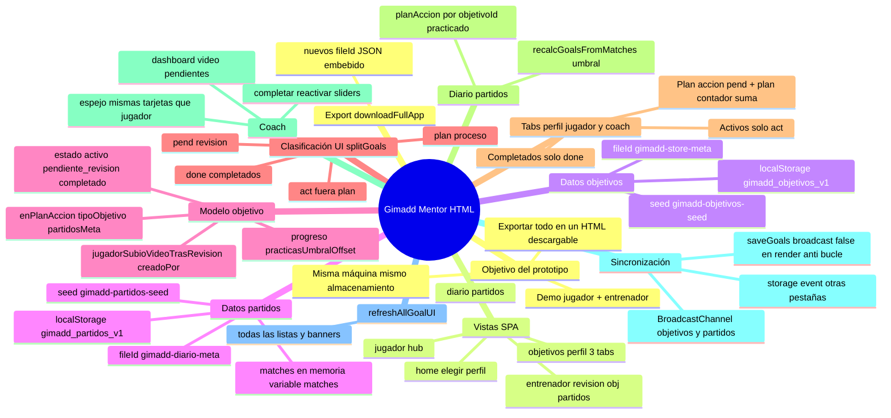

# Contexto del proyecto Gimadd Mentor (prototipo HTML)

**Uso:** copia todo este archivo y pégaló en ChatGPT cuando quieras que entienda el prototipo sin abrir el código. Describe la lógica funcional y técnica de `gimadd-mentor-jugador-app.html` (una sola página, SPA en JavaScript vanilla).

---

## 1. Mapa mental (Mermaid)

Puedes pegar este bloque en ChatGPT; si el modelo renderiza Mermaid, verá el diagrama. Si no, sirve igual como estructura jerárquica legible.




---

## 2. Mismo mapa en texto (árbol)

```
gimadd-mentor-jugador-app.html (SPA)
├── Vista `home`          → Elegir jugador / entrenador; botón descargar HTML con datos incrustados
├── Vista `jugador`       → Explicación flujo videoanálisis; banner aviso si hay objetivos en revisión;
│                           accesos a `objetivos` (perfil) y `diario`; botón simula “subí vídeo”
├── Vista `objetivos`     → Perfil “Juan” + stats + 3 tabs:
│   ├── Plan de acción    → sub-secciones: Pendiente de revisión | Plan de acción en proceso
│   ├── Objetivos activos → activos sin plan
│   └── Objetivos completados
│                           FAB + modal crear/editar; barra/slider progreso si activo; acciones editar, quitar plan, borrar
├── Vista `entrenador`    → Roster demo (solo Juan con datos) + 3 paneles:
│   ├── Revisión / vídeo  → Lista “sin vídeo confirmado” + todos los pendiente_revisión; acciones completar/reactivar
│   ├── Objetivos          → Sub-tabs iguales que jugador + FAB coach + espejo con sliders
│   └── Partidos          → Lista partidos solo lectura
├── Vista `diario`        → Lista partidos, stats, formulario partido con plan de acción enlazado a objetivos activos en plan
├── Persistencia
│   ├── Objetivos: localStorage `gimadd_objetivos_v1` + `gimadd_objetivos_v1_fileId` vs meta embebida
│   └── Partidos: localStorage `gimadd_partidos_v1` + `gimadd_partidos_v1_fileId` vs meta diario
├── Sincronización multi-pestaña
│   ├── `storage` (clave objetivos o partidos)
│   └── BroadcastChannel `gimadd_objetivos_channel` / `gimadd_partidos_channel`
└── Regla crítica: `render()` persiste con `saveGoals(goals, { broadcast: false })` para no re-entrar `onmessage` del mismo canal en la misma pestaña (evita cuelgue)
```

---

## 3. Qué problema resuelve el prototipo

- Un **jugador** y un **entrenador** comparten **objetivos** y **diario de partidos** en el **mismo navegador** (demo local).
- El **plan de acción** del jugador en el diario cuenta prácticas; al llegar a un **umbral** (`partidosMeta`), el objetivo pasa a **pendiente de revisión** (videoanálisis).
- El entrenador **completa** objetivos o los **reactiva** con un %; el jugador **no** marca completado.
- Todo puede **volcarse en el HTML** descargado (nuevos `fileId` para no mezclar datos viejos de `localStorage` al abrir otro archivo).

---

## 4. Navegación técnica

- Función `**showView(name)`**: pone `is-active` en `<section class="app-view" data-view="...">` y clase `app-{name}` en `<body>`.
- **Carga con hash** (para enlaces / pruebas): si la URL tiene `#jugador`, `#objetivos`, `#entrenador` o `#diario`, el arranque llama a `showView` con ese id; si no hay hash, `home`.

---

## 5. Modelo de datos — Objetivo (objeto en array JSON)

Campos que el código normaliza o usa de forma significativa:


| Campo                            | Rol                                                                                                                                   |
| -------------------------------- | ------------------------------------------------------------------------------------------------------------------------------------- |
| `id`                             | String único (p. ej. `g-{timestamp}-{random}`)                                                                                        |
| `titulo`                         | Texto                                                                                                                                 |
| `estado`                         | `activo`                                                                                                                              |
| `completado`                     | Booleano coherente con `estado`                                                                                                       |
| `enPlanAccion`                   | Bool; solo activos en plan van a “plan en proceso”                                                                                    |
| `tipoObjitivo`                   | `clase`                                                                                                                               |
| `partidosMeta`                   | Entero 1–50; umbral de partidos con práctica marcada                                                                                  |
| `progreso`                       | 0–100; barra + slider (jugador si activo; coach también en activo y pendiente revisión)                                               |
| `practicasUmbralOffset`          | Al **reactivar**, se pone a `countPracticasGoalInMatches(id)` para no exigir prácticas “fantasma”                                     |
| `jugadorSubioVideoTrasRevision`  | Tras pasar a revisión se pone `false`; el jugador puede simular subida con botón en hub (pone `true` en todos los pendiente revisión) |
| `pendienteRevisionDesde`         | Fecha ISO (YYYY-MM-DD) cuando entra en pendiente por umbral                                                                           |
| `fechaLimite`, `fechaCompletado` | Opcionales, UI                                                                                                                        |
| `creadoPor`                      | `jugador`                                                                                                                             |


`**splitGoals(goals)`** devuelve cuatro listas:

- **pend:** `estado === "pendiente_revision"`.
- **plan:** `estado === "activo"` y `enPlanAccion`.
- **act:** `estado === "activo"` y no plan.
- **done:** `estado === "completado"`.

**Tabs “Plan de acción” (jugador y entrenador):** muestra primero pend, luego plan; el **número en la pestaña** es `pend.length + plan.length`.

---

## 6. Modelo de datos — Partido (diario)

Cada elemento en `matches` / localStorage suele tener: `id`, `date`, `outcome`, `sets`, `partner`, `club`, `feel`, `feelText`, `notes`, y `**planAccion`**: array de `{ objetivoId, titulo, practicado, sensaciones }`.

**Conteo de prácticas para un objetivo:** en cuántos partidos existe al menos un ítem de `planAccion` con ese `objetivoId` y `practicado === true`.

`**effectivePracticasCount(g)`** = ese conteo menos `g.practicasUmbralOffset` (mínimo 0).

`**recalcGoalsFromMatches()`:** para cada objetivo **activo** y **en plan**, si `effectivePracticasCount >= partidosMeta`, pasa a `pendiente_revision`, `jugadorSubioVideoTrasRevision = false`, `pendienteRevisionDesde` hoy; luego `saveGoals` si hubo cambios y **siempre** `refreshAllGoalUI()`.

Se llama al guardar partido, al cargar vistas relevantes, y en listeners de storage/BroadcastChannel/focus.

---

## 7. Funciones centrales

- `**loadGoals()` / `saveGoals(goals, opts)`:** lee/escribe localStorage, **sincroniza** el contenido del `<script id="gimadd-objetivos-seed">`** en el DOM** (para que `downloadFullApp` coja datos actuales). `saveGoals` hace `BroadcastChannel` salvo si `opts.broadcast === false`.
- `**render()`:** normaliza, persiste con `**{ broadcast: false }`**, vuelca las cuatro listas en el DOM del jugador, actualiza contadores de secciones **y** de las tres pestañas, reenlaza sliders jugador (`bindRanges`).
- `**renderCoachGoalsMirror()`:** igual para listas del panel Objetivos del entrenador (subpaneles pend/plan/act/done) y contadores de sub-pestañas; `bindCoachRanges()`.
- `**renderEntrenadorDashboard()`:** llena “sin vídeo” (pendiente revisión con `jugadorSubioVideoTrasRevision === false`) y “todos los pendientes”; nota simulada los **lunes** sobre recordatorio al entrenador.
- `**refreshAllGoalUI()`:** `updateHomeNotifBanner`, `render`, `renderCoachGoalsMirror`, `renderEntrenadorDashboard`, `renderCoachMatches`, y si existe `renderPlanAccionSection` en diario.
- `**persistMatches()`:** guarda `matches` en localStorage, sincroniza seed partidos en DOM, `BroadcastChannel` partidos, `renderCoachMatches()`.

---

## 8. Interacciones importantes

**Jugador — modal objetivo:** título, fecha, tipo, `partidosMeta`, checkbox plan (solo si al editar está activo se puede mantener coherente). Nuevos objetivos: `estado: activo`, `creadoPor` según quién abrió el modal (`goalFormOpenedFrom`).

**Jugador — tarjeta:** `data-action` edit / delete / toggle-plan (solo activo).

**Jugador — progreso:** `pointerdown` en `.progress-track[data-progress-id]` o `<input class="rng-progress">` (slider) con guardado al soltar.

**Entrenador — espejo:** mismos bloques que jugador; sliders con clase `rng-coach-progress` y `data-coach-prog-id`; clicks en `data-coach-goal-action` (edit, delete, toggle-plan, completar en mirror — vía `handleCoachMirrorGoalClick`).

**Entrenador — dashboard revisión:** `data-coach-act` completar / reactivar; slider `data-coach-rng` para % al reactivar.

**Botón “He subido un nuevo vídeo”:** para cada objetivo en `pendiente_revision`, pone `jugadorSubioVideoTrasRevision = true` y guarda (simulación).

**Descarga `downloadFullApp()`:** clona `outerHTML`, reemplaza los cuatro bloques JSON (`gimadd-store-meta`, `gimadd-objetivos-seed`, `gimadd-diario-meta`, `gimadd-partidos-seed`) con datos vivos y **nuevos** `fileId` para objetivos y diario.

---

## 9. Invariantes y bugs evitados

- **BroadcastChannel en la misma pestaña** también dispara `onmessage`; por eso `**render()` no debe** hacer `postMessage` (bucle infinito / cuelgue de Chrome).
- **Empate `fileId`:** si el `fileId` del meta embebido difiere del último guardado en `localStorage`, se **resetea** el almacén desde el seed del HTML (importación / nuevo archivo).

---

## 10. Resumen en una frase para el modelo

*Es una SPA offline-first que guarda objetivos y partidos en `localStorage` y en scripts JSON dentro del propio HTML, sincroniza pestañas con `storage` y `BroadcastChannel`, clasifica objetivos en cuatro cubetas (`splitGoals`), muestra tres pestañas en jugador y entrenador-objetivos (plan = pend+plan, activos, completados), y promueve objetivos de plan activo a “pendiente de revisión” cuando las prácticas registradas en partidos alcanzan `partidosMeta`.*

---

*Fin del contexto. Archivo fuente del prototipo: `gimadd-mentor-jugador-app.html` en esta misma carpeta (`diseño-servicios`).*