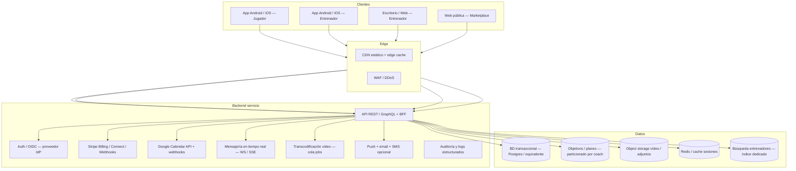
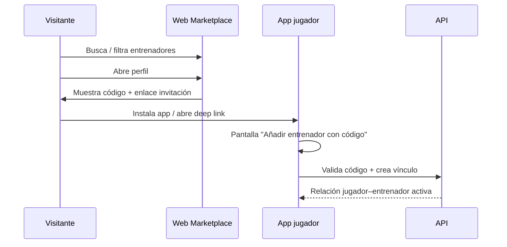
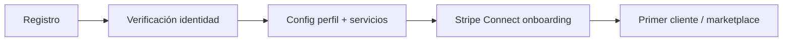
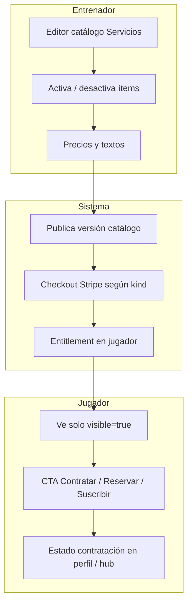
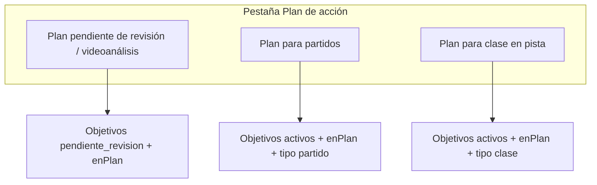
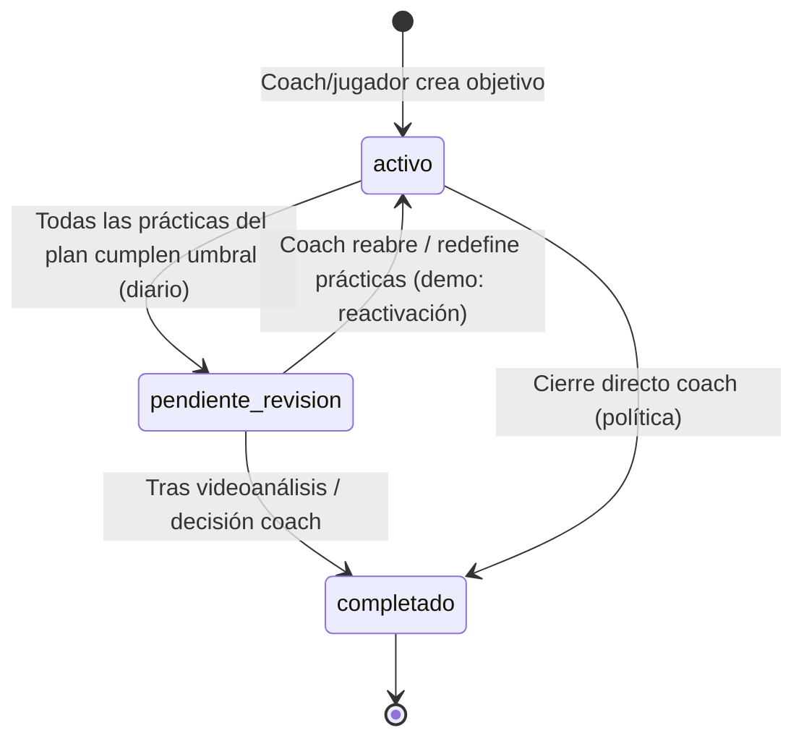
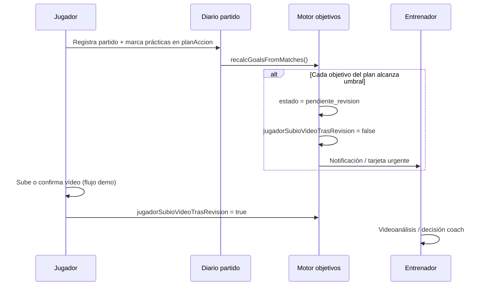
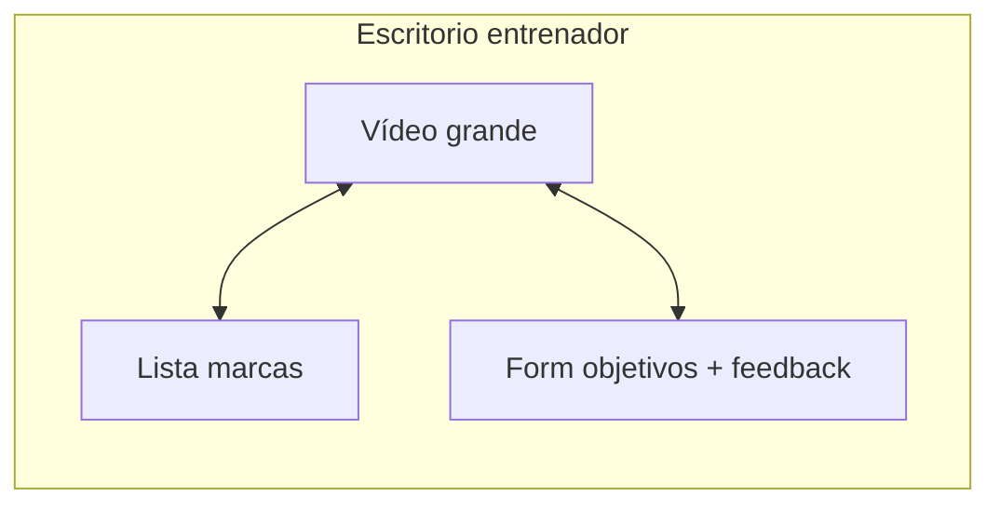
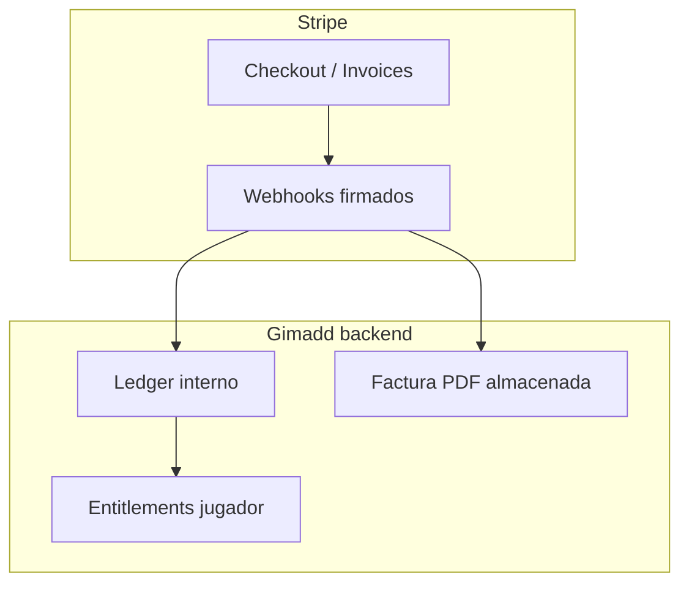
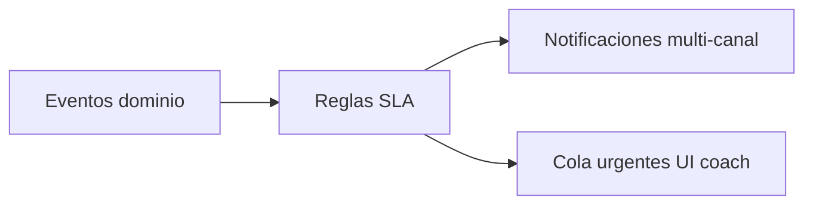

# Gimadd Mentor — Alcance funcional, flujos y criterios técnicos para presupuesto

**Versión del documento:** 1.1 (Mayo 2026)  
**Producto:** Gimadd Mentor — plataforma de entrenamiento y acompañamiento en **pádel** (jugadores ↔ entrenadores).  
**Audiencia:** empresas de desarrollo, integradores, arquitectos y responsables de producto que deban **presupuestar** implementación nativa, backend, seguridad y operación.

---

## 0. Cómo leer este documento

1. **Demo actual (HTML único):** en el repositorio existe una **plantilla funcional** (`Gimadd_Mentor_APP.html`) que simula flujos con `localStorage`, seeds JSON embebidos y navegación tipo SPA. Sirve como **especificación de comportamiento deseado** a nivel UX y reglas de negocio *a alto nivel*.
2. **Producto objetivo:** aplicaciones **nativas Android e iOS**, **cliente web o escritorio para el entrenador** (prioridad: **videoanálisis con vídeo grande** y gestión masiva de clientes), backend multi-tenant, pagos con **Stripe**, calendario con **Google Calendar**, notificaciones, analítica y escalado a **millones de usuarios**.
3. Donde diga *«en la demo»* se refiere al HTML; donde diga *«en producción»* se refiere al objetivo contractual.

---

## 1. Resumen ejecutivo

Gimadd Mentor conecta **jugadores** con **entrenadores verificados** para:

- Definir y seguir **objetivos** vinculados a un **plan de acción** (prácticas en **diario de partidos** y/o **diario de clases en pista**).
- Enviar y revisar **vídeos** con **videoanálisis** (marcas temporales, feedback textual y adjuntos).
- Contratar **servicios** del catálogo del entrenador (sesión, pack, suscripción, programas de acompañamiento).
- Gestionar **agenda** (clases presenciales), **mensajería**, **CRM de clientes**, **finanzas** (con integración de pagos) y **marketplace público** de entrenadores.

La base actual debe ser **modular y extensible**: hoy pádel y flujo coach–jugador; mañana más deportes, automatizaciones, IA sobre vídeo, informes federativos, etc.

### 1.1 Plataformas objetivo

| Plataforma | Rol principal | Requisitos destacados |
|------------|----------------|------------------------|
| **Android (nativa)** | Jugador y entrenador (o apps separadas por flavor) | Offline-first parcial, cámara, subida de vídeo, push |
| **iOS (nativa)** | Igual | AVFoundation, background upload, push (APNs) |
| **Escritorio entrenador** | Panel cómodo multi-cliente | **Vídeo grande**, teclado/ratío, multitarea, exportaciones |
| **Web jugador (opcional)** | Paridad con móvil | Responsive, PWA opcional |

> **Decisión de producto recomendada:** misma cuenta puede iniciar sesión en móvil y escritorio; el **workspace de videoanálisis** en escritorio es una **vista optimizada** (timeline ancha, teclas rápidas, lista de marcas lateral).

---

## 2. Arquitectura lógica (visión objetivo)



**Nota de presupuesto:** el diagrama es **agnóstico de proveedor**; equipos pueden mapear a Firebase, AWS, GCP o Azure siempre que cumplan requisitos de seguridad, RGPD y coste predecible a escala.

---

## 3. Actores, espacios de datos y permisos (RBAC)

### 3.1 Actores

| Actor | Descripción |
|-------|-------------|
| **Jugador** | Consume servicios, registra diario, objetivos, sube vídeos, chatea con su(s) entrenador(es). |
| **Entrenador** | Gestiona catálogo, CRM, seguimiento, videoanálisis, agenda, finanzas; puede crear/editar objetivos del jugador según permisos. |
| **Admin plataforma** (futuro) | Verificación KYC entrenadores, moderación, soporte, métricas globales. |
| **Visitante** | Solo marketplace público y enlaces de invitación. |

### 3.2 Principio de multi-tenancy

- **Tenant principal:** *organización del entrenador* o *entrenador individual* (según modelo de negocio).
- Un **jugador** puede tener **varios entrenadores** (códigos de invitación distintos); cada relación tiene **servicios contratados**, **hilos de chat** y **objetivos** acotados a esa relación.

### 3.3 Matriz de permisos (resumen)

| Recurso | Jugador | Entrenador | Notas producción |
|---------|---------|------------|-------------------|
| Perfil propio | CRUD | CRUD | Campos verificados solo por admin |
| Objetivos del jugador | Crear limitado; editar progreso según política | CRUD completo; ajuste % | En demo, coach ajusta % en más estados |
| Diario (partidos/clases) | CRUD propio | Lectura + anotaciones opcionales | Versionado de filas |
| Vídeo / análisis publicado | Ver, descargar según plan | Crear borrador, publicar | ACL por `playerId` + `coachId` |
| Catálogo servicios | Ver activos | CRUD + visibilidad | Versiones de precio |
| Contratación / pagos | Iniciar checkout | Ver estado, disputas | Stripe customer / Connect |
| CRM | — | CRUD clientes | Datos personales — RGPD |
| Finanzas | Ver propios recibos (futuro) | Wallet, payouts | Stripe Connect |
| Marketplace público | Ver | Perfil verificado | Indexación SEO |

---

## 4. Marketplace público (`marketplace-entrenadores.html`)

**Propósito:** listado **fuera de la app nativa** (web estática o SSR futuro) de entrenadores verificados con búsqueda, filtros y **perfil público** (bio, servicios, valoraciones, código de invitación).

### 4.1 Flujo visitante → app



**En la demo:** el código puede coincidir con el del CRM del entrenador; en producción debe ser **código único rotativo** o **enlace firmado** con caducidad.

**Presupuesto:** SEO, rate limiting en API de búsqueda, CDN, moderación de perfiles, imágenes optimizadas (WebP/AVIF), indexación multidioma si aplica.

---

## 5. Alta de entrenador y alta de jugador

### 5.1 Nuevo entrenador (producción)

1. Registro (email/teléfono + verificación).
2. **KYC / verificación** (documento, titulación, seguro RC profesional según país).
3. Creación de **tenant** y **catálogo** por defecto (seed de servicios predefinidos, todos desactivables).
4. Generación de **código de invitación** y **plantillas** de mensajes (CRM).



### 5.2 Nuevo jugador

1. Registro jugador.
2. **Vinculación** con entrenador: código, QR o enlace invitación.
3. Importación opcional de datos demo → en producción, **lista vacía** de objetivos y diario.

### 5.3 En la demo HTML

- **Jugador:** selector en home (`demo-juan`, etc.); lista de entrenadores en `localStorage` (`gimadd_jug_trainers_v1`).
- **Entrenador:** flujo “hub” separado; CRM con clientes seed.

**Presupuesto:** flujos de **invitación por club** (varios jugadores), **menores** (consentimiento parental), **borrado de cuenta**.

---

## 6. Servicios: catálogo, contratación y desglose por tipo

### 6.1 Modelo conceptual de un ítem de catálogo

Campos conceptuales (alineados con la demo y `gimadd-coach-servicios-seed`):

| Campo | Uso |
|-------|-----|
| `id` | Identificador estable |
| `kind` | `individual` \| `pack` \| `mensual` \| `acompanamiento` |
| `tag` | Etiqueta corta UI |
| `title` / `desc` / `meta` | Copy comercial; `meta` suele llevar **precio individual / pareja** y condiciones |
| `visible` | Si aparece al jugador |
| `sort` | Orden en UI |

**Agrupación en UI jugador (demo):** “Sesiones y análisis”, “Packs”, “Suscripciones”, “Programas”.

### 6.2 Servicios predefinidos (semilla actual)

> En producción son **plantillas editables**; el entrenador puede renombrar, ocultar o duplicar.

| ID | Tipo (`kind`) | Título (resumen) | Precio / condiciones en `meta` (demo) |
|----|---------------|------------------|----------------------------------------|
| `cat-video` | individual | Videoanálisis | individual 45 € · parejas 72 € · entrega ~48 h |
| `cat-pista` | individual | Mentoría en pista | individual 55 € · parejas 90 € · 60 min |
| `cat-pack` | pack | Pack intensivo — pista + videoanálisis | individual 420 € · parejas 360 € · validez 3 meses |
| `cat-mensual` | mensual | Plan Pro mensual | individual 149 €/mes · parejas 199 €/mes |
| `cat-acomp-3` | acompañamiento | Impulso Momentum — 90 días | individual 429 € (3 meses) · parejas 589 € |
| `cat-acomp-6` | acompañamiento | Progresión Semestral | individual 789 € (6 meses) · parejas 1.099 € |
| `cat-acomp-12` | acompañamiento | Legado Anual — 12 meses | individual 1.349 € · parejas 1.849 € |

**Características a presupuestar por tipo:**

| Tipo | Qué implica contratarlo (negocio + sistema) |
|------|-----------------------------------------------|
| **individual** | Compra o reserva puntual; puede abrir flujo **clase presencial** (solicitud sin fecha → coach programa). Videoanálisis: **cupos de entrega**, SLA, cola de revisión. |
| **pack** | Pago único; **bolsa de cupos** (pista + vídeo) con **caducidad**; decremento atómico al consumir; informes de uso. |
| **mensual** | **Suscripción** recurrente; renovación mensual; cancelación prorrateada según política; límites de uso; webhooks Stripe `invoice.paid` / `customer.subscription.deleted`. |
| **acompanamiento** | Proyecto largo; hitos; sin “cupos rígidos” en copy — en sistema igualmente requieren **medición de uso** y límites fair-use para abuso. |

### 6.3 Cómo lo ve el jugador vs el entrenador



**En la demo:** checkout simulado; en producción **Stripe Checkout + Customer Portal** y tabla `entitlements`.

### 6.4 Desglose operativo por ítem de catálogo (presupuesto funcional)

Cada fila describe **qué debe ocurrir en sistema** desde el clic de “Contratar” hasta el **entitlement** activo y los **jobs** posteriores (recordatorios, consumo de cupos, renovaciones).

| ID catálogo | Pasos jugador | Pasos sistema tras pago OK | Entitlement / consumo | Entregables a estimar |
|-------------|---------------|----------------------------|-------------------------|------------------------|
| **cat-video** | Elegir individual o pareja → checkout → confirmación | Crear `purchase` + `entitlement` tipo análisis; cola “pendiente de material”; SLA countdown | Cupo de **1 entrega** de análisis (o N si el coach vende packs de vídeos en otro ítem) | Notificación coach, cola videoanálisis, plantilla email al jugador con instrucciones de grabación |
| **cat-pista** | Igual | Crear reserva en estado **pendiente de fecha** o con slot si ya existe; vincular a agenda | 1 sesión presencial “consumible” al marcar `completada` o según política | Estados de reserva, sync calendario, mensajería automática si sin fecha |
| **cat-pack** | Checkout único | Bolsa de cupos (pista + vídeo según copy); `expires_at` | Decremento atómico por consumo; aviso antes de caducidad | Informe uso, bloqueo si caducado |
| **cat-mensual** | Suscripción | `Subscription` Stripe; webhook `invoice.paid` renueva cupos mensuales | Activo mientras sub activa; límites en ledger | Portal cliente, dunning, proration |
| **cat-acomp-3/6/12** | Pago programa | Proyecto largo; hitos opcionales; mismo motor de objetivos/plan | Fair-use + límites de vídeo/pista según contrato | Informes de progreso, renovación al final |

---

## 7. Objetivos y plan de acción

### 7.1 Estados del objetivo

| `estado` | Significado |
|----------|-------------|
| `activo` | En curso. |
| `pendiente_revision` | Cerró prácticas requeridas en diario (u otra regla); espera **videoanálisis** / decisión del coach. |
| `completado` | Cerrado por coach o por flujo automático según reglas. |

**Bandera `enPlanAccion`:** si es `true` y está `activo`, el objetivo cuenta en sub-pestañas “Plan para partidos / Plan para clase”. Si **todos** los del plan cumplen prácticas → pasan a revisión según reglas de la demo (`recalcGoalsFromMatches`).

### 7.2 Objetivos dentro del plan (agrupación UI)



### 7.3 Progreso %

- En producción: **fuente de verdad** puede ser coach-only o mixta; la demo permite ajuste por coach en varios estados para UX.
- Auditar cada cambio de % (quién, cuándo, objetivo, valor anterior).

### 7.4 Máquina de estados (objetivo)



**Regla crítica (alineada con demo):** el paso colectivo a `pendiente_revision` es cuando **todos** los objetivos con `enPlanAccion` y `estado === activo` cumplen sus prácticas en diario; hasta entonces, un objetivo puede mostrar prácticas completas (✅) pero **no** dispara revisión en solitario.

---

## 8. Diario de partidos y diario de clases

### 8.1 Partidos

- Campos típicos: fecha, resultado, sets, sensaciones, notas.
- **`planAccion`**: lista de vínculos a objetivos del plan con flags `practicado` y texto de sensaciones.
- **Recálculo:** al guardar partido, el sistema cuenta prácticas efectivas por objetivo y puede promover a `pendiente_revision` si alcanza `partidosMeta` (con offset `practicasUmbralOffset` para reactivaciones).

### 8.2 Clases en pista

- Registro separado del de partidos; alimenta objetivos tipo **`clase`** en plan.
- En producción: posible integración con **wearables** o importación CSV club (futuro).

### 8.3 Comentarios del plan dentro del diario y paso a “pendiente de revisión”



**Campos relacionados en demo:** `pendienteRevisionDesde`, `jugadorSubioVideoTrasRevision`.

---

## 9. Video: grabación, subida y videoanálisis

### 9.1 Grabación / subida (jugador)

Flujo conceptual:

1. Seleccionar archivo o grabar in-app.
2. **Chunked upload** a storage firmado; barra de progreso; reintentos.
3. Virus scan + transcodificación (HLS/MP4 múltiples bitrate).
4. Notificación al entrenador.

**En la demo:** no hay servidor; mensaje simulado.

### 9.2 Videoanálisis (entrenador) — opciones a cubrir

| Funcionalidad | Descripción | Prioridad escritorio |
|----------------|-------------|------------------------|
| Reproductor | Play/pausa, velocidad, frame-step (futuro) | Alta |
| Marcas temporales | Texto por instante `t` | Alta |
| Objetivos desde revisión | Crear objetivo y marcar “en plan” | Alta |
| Feedback | Nota global + adjuntos vídeo/audio/imagen | Media |
| Publicación | Genera “Vídeo № NNN”, empaqueta marcas y notifica jugador | Alta |
| Historial | Lista por jugador; jugador elige análisis | Alta |
| Vinculación plan | Objetivos del plan asociados al número de vídeo publicado | Media |

### 9.3 Inventario de controles UI (jugador — análisis publicado)

Inspirado en la demo (`view-jug-videoanalisis`): **historial** de análisis; reproductor con **pantalla completa**; transporte **Play**; saltos **−5 s / +5 s**; **barra de seek**; **velocidad** 0,75× / 1× / 1,25×; lista **Marcas y comentarios**; bloque **Objetivos del plan en este vídeo**; **Feedback** del coach (nota + rejilla de adjuntos imagen/vídeo/audio).

### 9.4 Inventario coach (consola de revisión)

Además de lo anterior: **añadir marca** en tiempo actual; **texto por marca**; **objetivos desde revisión** (crear y marcar `enPlanAccion`); **nota global**; **adjuntos**; **publicar** análisis; en escritorio: **atajos de teclado** (fase 2), **vista dual** (cámara + campo), timeline ancha.

**Escritorio coach:** layout tipo “three column” — vídeo central 60–70% ancho, marcas y notas laterales, lista de clientes colapsable.



---

## 10. Mensajería jugador ↔ entrenador

- **Modelo:** hilo por pareja `(coachId, playerId)`; mensajes append-only con `createdAt`.
- **Entrega:** WebSocket o polling eficiente; push cuando app en background.
- **Moderación (futuro):** reportar, bloqueo, retención.

**En la demo:** mensajes en memoria + `localStorage` / seed.

---

## 11. Seguimiento de un jugador (panel entrenador)

Vistas típicas (como en la demo):

1. **Perfil** — datos CRM + ficha.
2. **Videoanálisis** — consola de revisión + cola/historial.
3. **Objetivos** — espejo de las listas del jugador con acciones de coach.
4. **Diario** — lectura partidos/clases.
5. **Agenda del jugador** — reservas presenciales ligadas.

**Objetivo de UX:** cero “saltos” innecesarios; deep links desde alertas.

---

## 12. CRM de clientes (entrenador)

### 12.1 Propósito y leyenda (como en la demo)

- **Copy:** priorizar a quién atender: urgentes, clientes nuevos, seguimiento activo; leads sin servicio y reactivación en un solo listado.
- **Leyenda visual:** 🔴 Necesita acción · 🟡 Nuevo / reciente · 🟢 Seguimiento activo (la prioridad real se calcula en servidor; en demo es heurística local).

### 12.2 Entidades y campos (concepto)

- **Cliente:** `nombre`, teléfono, email, notas, **tipo de servicio** (`tipoServicio` / CRM), flag **servicio activo** vs pausa, **objetivo principal** (texto resumen), **progreso plan** (texto o agregado live si hay `linkedProfile`), **última actividad** (texto), **alta CRM** (`creadoEn`), **`linkedProfile`** opcional (id jugador en app), **`esNuevo`**.
- **Futuro:** timeline de interacciones (llamada, email, WhatsApp, tarea), etiquetas, valor estimado, riesgo de churn.

### 12.3 Barra de búsqueda y filtros (presupuesto explícito)

| Control | Valores / comportamiento |
|---------|---------------------------|
| **Buscar** (`crmSearchInput`) | Texto libre sobre: nombre, teléfono, email, notas, objetivo principal, campos visibles en preview |
| **Prioridad** | Todas · Necesita acción (0) · Nuevo/reciente (1) · Seguimiento activo (2) |
| **Tipo servicio** | Desplegable poblado dinámicamente con los tipos presentes en clientes |
| **Estado servicio** | Cualquiera · Activo (contratado) · Inactivo/pausa · Lead (sin servicio) |
| **App jugador** | Cualquiera · Con perfil en app · Sin perfil en app |
| **Alta** | Todas · Marcado como nuevo · No nuevo |
| **Contador resultados** | “N clientes” o “Mostrando X de N” si hay filtro activo |

### 12.4 Alta de cliente (modal “Añadir cliente”)

Tres pestañas (tablist):

1. **Manual:** formulario nombre (obligatorio), teléfono, email, **tipo de servicio inicial** (opciones: sin servicio/lead, mentoría individual, mentoría grupal, videoanálisis, pack, mensual, programas 3/6/12 meses) → guardar en CRM.
2. **Link genérico:** URL tipo `https://gimadd.app/unirse?entrenador={id}` + botón copiar (en producción: token firmado o código de un solo uso).
3. **Tu código:** código corto para flujo jugador “Añadir con código” + copiar.

### 12.5 Tarjeta de cliente (acordeón)

- **Cabecera:** avatar (foto o iniciales), nombre, **badge** de prioridad, **preview** una línea: texto servicio + actividad reciente.
- **Cuerpo expandido:** filas **Servicio**, **Actividad reciente**, **Objetivo principal (plan)**, **Progreso plan**, **Alta (CRM)** si existe.
- **Fila de CTAs (`crm-cta-row`):**
  - Ver perfil
  - **Analizar vídeo** (primario)
  - Enviar mensaje
  - Ver servicios activos
  - **Seguimiento completo** (solo si el cliente está vinculado al perfil demo con datos live; en producción: si existe `playerId` vinculado)

### 12.6 Ordenación

Lista ordenada por **tier de prioridad** (ascendente: rojo primero) y luego **nombre** (locale), de modo que el coach ve arriba lo que quema.

---

## 13. Finanzas (entrenador) y Stripe

**En la demo:** billetera con tabs Resumen / Pagos / Facturas / Estadísticas; acciones “enviar email” y “automatizar” simuladas.

**En producción (Stripe):**

| Componente | Uso |
|------------|-----|
| **Stripe Connect** | Payouts a entrenadores; split opcional plataforma |
| **Checkout / Elements** | Cobro servicios y suscripciones |
| **Billing Portal** | Gestión método pago y cancelaciones |
| **Invoices + Tax** | IVA/VAT según país entrenador |
| **Webhooks** | Idempotencia obligatoria; tabla ledger interna |



### 13.1 Secuencia recomendada — webhooks Stripe (idempotencia)

```mermaid
sequenceDiagram
  participant S as Stripe
  participant W as Webhook endpoint (API)
  participant L as Ledger DB
  participant E as Entitlements
  participant N as Notificaciones

  S->>W: POST event (signed)
  W->>W: Verificar firma + deduplicar por event.id
  alt checkout.session.completed
    W->>L: Insertar línea ingreso + external_id
    W->>E: Activar producto contratado (jugador, coach)
    W->>N: Push/email confirmación
  else invoice.paid (suscripción)
    W->>L: Asiento renovación
    W->>E: Recargar cupos mensuales
  else charge.dispute / refund
    W->>L: Asiento contrario + motivo
    W->>E: Ajustar o revocar según política
  end
  W-->>S: 200 OK (rápido; trabajo pesado en cola)
```

**Requisito de presupuesto:** tabla `stripe_events_processed`, workers asíncronos, reintentos con exponential backoff, alerta si el mismo `invoice` falla N veces.

### 13.2 Tabs “Mi billetera” (demo como checklist UI)

| Tab | Contenido esperado en producción |
|-----|----------------------------------|
| **Resumen** | Saldo disponible, retenciones, próximo payout |
| **Pagos** | Lista cobros, estado, jugador, servicio |
| **Facturas** | PDF generados / descarga |
| **Estadísticas** | Serie temporal, ARPU, mix servicios |

---

## 14. Agenda y Google Calendar

**Flujo deseado:**

1. Jugador solicita clase (sin fecha) o coach propone slot.
2. Al confirmar fecha → evento **Google Calendar** en calendario del coach (y opcionalmente jugador).
3. Cambios (reprogramación) propagados vía API; conflictos detectados.

**En la demo:** mock “embed” y estado en `presencialBookings`.

**Presupuesto:** OAuth Google por entrenador, refresh tokens cifrados, sync bidireccional (opcional fase 2), manejo de zonas horarias.

### 14.1 Secuencia — crear / actualizar / cancelar evento

```mermaid
sequenceDiagram
  participant C as Coach app
  participant API as Gimadd API
  participant DB as BD reservas
  participant G as Google Calendar API

  C->>API: Confirmar slot clase (fecha, hora, tz)
  API->>DB: Upsert booking + estado programada
  API->>G: insert event (calendarId coach)
  G-->>API: eventId + htmlLink
  API->>DB: Guardar googleEventId
  Note over API,G: Reprogramación: patch event; Cancelación: delete o update transparency
```

**Errores a presupuestar:** token revocado (re-auth UX), conflicto de slot, rate limit Google, divergencia si el coach edita el evento a mano en Google (sync inbound fase 2).

---

## 15. Alertas y acciones urgentes

**Fuentes típicas:**

- Objetivo en `pendiente_revision` sin vídeo tras X días (demo: 7 días).
- Reserva pendiente de pago / confirmación.
- Mensaje no leído prioritario (coach).
- Suscripción próxima a expirar / fallo de pago.

**Entrega:** push + inbox in-app + digest email configurable.



### 15.1 Tipos de tarjeta “urgente” en la demo (referencia de implementación)

| Rol | `kind` / origen | Cuándo aparece | Acción al pulsar |
|-----|-----------------|----------------|------------------|
| **Jugador** | `video-plan` | Plan en `pendiente_revision` | Sin vídeo → **Grabar**; con vídeo → **Objetivos / revisión** |
| **Jugador** | `repro` | Reserva `solicitud_reprogramacion` | **Mensajes** |
| **Jugador** | `fecha` | Sin fecha de sesión | **Mensajes** |
| **Jugador** | `diary` / `diary-group` | Clases a anotar en diario | **Diario** |
| **Entrenador** | `crm` | Cliente con prioridad tier 0 (necesita acción) | **Seguimiento** perfil o abrir **CRM** |
| **Entrenador** | `repro` | Misma reserva que jugador pero copy orientada a coach | **Seguimiento** |
| **Entrenador** | `fecha` | Reserva sin fecha (nombre jugador) | **Seguimiento** |

En producción, estas mismas categorías deben mapearse a **eventos de dominio** y **plantillas de notificación** reutilizables.

---

## 16. Pantalla de inicio — jugador

La home del jugador (`renderJugadorHubDashboard`) se compone de **tres tarjetas principales** más cabecera y **acciones rápidas** del shell inferior (navegación global).

### 16.1 Cabecera

| Elemento | Contenido | Por qué |
|----------|-----------|--------|
| **Atrás / contexto** | Vuelve al selector de app | Multi-demo; en prod puede ocultarse |
| **Avatar + saludo + sub** | Nombre jugador, línea secundaria (club / coach) | Identidad y contexto emocional |
| **Ajustes → Perfil** | Acceso a ficha | Autogestión datos y preferencias |

### 16.2 Tarjeta “Tu progreso” (`jugHubProgresoBody`)

| Estado UI | Qué muestra | Por qué |
|-----------|-------------|--------|
| **Sin objetivos en plan activo** y **sin** pendientes de revisión | Empty “Sin foco activo en el plan” + chip sesiones demo + CTA **Ir a objetivos** | Evita pantalla vacía; guía al plan |
| **Sin activos pero con** `pendiente_revision` | Bloque “Completado — pendiente de revisión” + CTA **Abrir bloque en revisión** | Cierra el loop prácticas → vídeo |
| **Con plan activo** | “Tu foco ahora”: título objetivo, **%** barra, texto motivacional (según si cumplió prácticas, si todo el plan cumplió, etc.), ratio **prácticas / meta**, chip sesiones, CTA **Abrir plan de acción** | Foco único reduce ansiedad; el % es señal visual rápida |

### 16.3 Tarjeta “Acciones urgentes” (`jugHubUrgentesBody`)

Generación dinámica (sin duplicar claves):

| Tipo (`kind`) | Dispara | CTA navegación |
|----------------|---------|----------------|
| **video-plan** (sin vídeo) | Plan en revisión y `jugadorSubioVideoTrasRevision` false | Ir a **Grabar/subir** |
| **video-plan** (vídeo OK) | Mismo plan pero vídeo confirmado | **Objetivos → plan → revisión** |
| **repro** | Reserva en `solicitud_reprogramacion` | **Mensajes** |
| **fecha** | Reserva sin fecha cerrada | **Mensajes** |
| **diary** / **diary-group** | Clases completadas sin nota en diario | **Diario** |
| **Ninguna** | Empty “Todo al día” | Refuerzo positivo |

### 16.4 Tarjeta “Clases y mentorías” (`jugHubClasesBody`)

- Hasta **4** próximas reservas no canceladas ni completadas: fecha/hora, **estado** (píldora coloreada), **pago**.
- Footer: **Reservar clase** (servicios) + **Ver toda la agenda**.
- Empty: “Sin clases a la vista” + CTA servicios.

### 16.5 Acciones rápidas (footer jugador)

Incluyen al menos: **Objetivos**, **Diario**, **Grabar vídeo**, **Servicios** / entrenadores — objetivo: **cuatro taps máximo** a la acción diaria más frecuente.

---

## 17. Pantalla de inicio — entrenador (hub)

### 17.1 Cabecera hub

| Elemento | Contenido | Por qué |
|----------|-----------|--------|
| **Avatar + saludo** | Nombre coach, ubicación / marca | Contexto operativo |
| **Perfil** | Acceso a perfil entrenador | Editar oferta y datos públicos |

### 17.2 Acciones rápidas (fila iconos)

| Botón | Destino | Por qué |
|-------|---------|--------|
| **Clientes** | CRM | Núcleo del día: lista priorizada |
| **Finanzas** | Billetera | Cash-flow visible |
| **Cupones** | (placeholder demo) | Promociones adquisición |

### 17.3 Tarjeta “Agenda de hoy” (`coachHubAgendaHoy`)

- Lista de **clases presenciales del día** (hora, jugador, estado).
- Empty: copy + **Ver agenda completa**.
- Clic fila: resuelve `playerId` y abre **Seguimiento → agenda del jugador** o agenda global.

### 17.4 Tarjeta “Acciones urgentes” (`coachHubUrgentes`)

Heurística demo (producción: misma taxonomía con datos servidor): revisiones de plan sin vídeo del jugador, solicitudes reprogramación, cobros pendientes simulados, etc. Footer **Abrir clientes**.

### 17.5 Tarjeta “Resumen financiero” (`coachHubFinanzas`)

- Mini KPIs (pendiente de cobro, mes, etc. según seed).
- Footer **Abrir finanzas**.

---

## 18. Permisos detallados y límites

### 18.1 Jugador — puede / no puede (producción recomendada)

| Puede | No puede (por defecto) |
|-------|-------------------------|
| Ver y crear registros de diario propios | Ver diarios de otros jugadores |
| Ver análisis publicados de su coach | Ver borradores de análisis |
| Iniciar checkout de servicios visibles | Editar catálogo coach |
| Enviar mensajes en su hilo | Enviar mensajes masivos |
| Proponer objetivos (si política) | Aprobar videoanálisis publicado |

### 18.2 Entrenador — puede / no puede

| Puede | No puede (por defecto) |
|-------|-------------------------|
| Gestionar clientes vinculados | Acceder a jugadores sin relación |
| Publicar videoanálisis | Borrar historial legal de facturación sin trazabilidad |
| Ajustar objetivos según política | Suplantar identidad jugador |

### 18.3 Auditoría

Registrar: logins, publicaciones, cambios de dinero, exportaciones CRM, descargas de vídeo.

---

## 19. Seguridad (mínimos para una app de estas características)

### 19.1 Autenticación y sesiones

- MFA opcional para coaches; detección de dispositivos nuevos.
- Refresh tokens rotativos; revocación remota.

### 19.2 Datos personales y RGPD

- Base legal (contrato, consentimiento marketing aparte).
- Derecho acceso/portabilidad/borrado con **ventanas legales** para facturación.
- Minimización: CRM no duplica datos innecesarios.

### 19.3 Vídeo y contenido sensible

- URLs firmadas con TTL corto.
- Cifrado en reposo en bucket (SSE-KMS o equivalente).
- Política de retención (borrado automático tras N meses si contrato lo permite).
- **Moderación CSAM:** integración con APIs de reporting del proveedor cloud (obligatorio en muchas jurisdicciones).

### 19.4 API

- OAuth2 / JWT; scopes por rol.
- Rate limiting, idempotency keys en POST críticos.
- Validación estricta de `coachId`/`playerId` en cada query.

### 19.5 Infra

- WAF, CSP headers en web, cert pinning opcional móvil.
- Pen-tests anuales + dependabot.

### 19.6 Amenazas adicionales (checklist breve)

- **Abuso de registro / SMS / email:** CAPTCHA, límites por IP, proveedor anti-fraude en checkout.
- **Robo de cuenta:** alerta login nuevo dispositivo, lista sesiones activas, cerrar sesión remota.
- **Insider:** mínimo privilegio en consola admin; logs inmutables (WORM o SIEM).
- **Backup:** cifrado en tránsito y reposo; pruebas de restauración trimestrales.
- **Dependencias:** SBOM y política de actualización críticos en 24–72 h.

---

## 20. Escalabilidad a millones de usuarios

| Capa | Estrategia |
|------|------------|
| Lectura | Réplicas BD, cache Redis, CDN para assets |
| Escritura | Particionado por `coach_id` o shard geográfico |
| Vídeo | Transcoding asíncrono; CDN origin shield |
| Búsqueda | Índice dedicado (OpenSearch / Algolia) para marketplace |
| Mensajería | Servicio elástico separado del API monolítico inicial |
| Observabilidad | OpenTelemetry, SLOs, alertas on-call |

**Principio:** separar **hot path** (feed jugador) de **cold path** (reporting financiero).

---

## 21. Extensiones futuras (sobre la misma base)

- IA asistida en videoanálisis (detección de patrones).
- Integración federaciones / rankings.
- Wearables y carga interna.
- Multi-deporte (tenant configurable por deporte).
- Marketplace con **pago in-app** y comisión plataforma.

---

## Anexo A — Detalle de producto para estimación (perfiles, catálogo, captación)

### A.1 Perfil del entrenador (datos y flujo de edición)

| Bloque | Campos / acciones típicas | Notas producción |
|--------|---------------------------|------------------|
| **Identidad** | Nombre público, foto, ubicación, idiomas | Sincronizar con marketplace SEO |
| **Credenciales negocio** | NIF/IVA, dirección fiscal, titular cuenta | Solo entrenador + admin; cifrado en reposo |
| **Stripe Connect** | Estado onboarding, payouts, última verificación | Webhooks actualizan badge “cobros OK” |
| **Invitación** | Código corto, URL genérica, QR (futuro) | Rate limit; regenerar código |
| **Catálogo** | Lista servicios con visibilidad, orden, precios | Versionado: cambio precio no afecta contratos vigentes salvo política |
| **Preferencias** | Zona horaria, buffer entre clases, plantillas mensaje | Afecta agenda y Google Calendar |

### A.2 Perfil del jugador

| Bloque | Campos / acciones | Por qué |
|--------|-------------------|--------|
| **Datos personales** | Nombre, contacto, foto | CRM puede espejar parte con consentimiento |
| **Deportivos** | Mano dominante, posición, nivel, club | Personaliza objetivos y copy |
| **Salud / lesiones** (opcional) | Flags, notas | Sensibles — consentimiento explícito y retención corta |
| **Cuenta vinculada** | Lista entrenadores, relación activa | Multi-coach sin mezclar datos |

### A.3 Catálogo del entrenador: crear, modificar, activar y desactivar

**Crear (“Añadir servicio al catálogo” en demo):**

1. **Tipo (`kind`)** — selector obligatorio: **Individual** (vídeo, pista u otra sesión suelta), **Pack** (pago único, cupos/validez), **Mensualidad** (recurrente), **Programa de acompañamiento** (3 / 6 / 12 meses).
2. **Textos** — título, descripción (Markdown ligero: `**negritas**` en demo), etiqueta corta.
3. **Precio** — la UI compone la “línea de precios” según el tipo (importes individual/pareja, periodicidad, meses).
4. **Visibilidad** — `visible` + `sort` para orden en la app jugador.

**Modificar / desactivar:** en producción, conviene **entidad `catalog_item` con `status: draft|active|archived`** y **histórico de precios**; desactivar no borra contratos existentes.

### A.4 Cómo ve el jugador “qué servicio tiene” vs cómo lo ve el entrenador

| Vista | Jugador | Entrenador |
|-------|---------|--------------|
| **Hub / perfil** | Resumen del plan activo, próximas clases, CTAs de renovación | CRM + seguimiento: tipo servicio, activo/pausa, lead |
| **Servicios** | Solo ítems `visible`; CTA contratación | Editor completo + preview |
| **Mensajes** (demo) | Línea CRM debajo del hilo si aplica | Estado cliente en cabecera chat |

### A.5 Grabación y envío de vídeo (demo como checklist de pantallas)

Pantalla **Grabaciones** (`view-jug-grabar`):

- Acciones: **Grabar nuevo vídeo** (input `capture=environment`), **Subir vídeo** (galería).
- **KPIs locales:** contadores grabaciones / análisis / subidas.
- **Contexto** dinámico si el plan está en revisión (montaje `jugGrabarContextMount`).
- Instrucciones: horizontal, duración orientativa, luz, nombre de archivo.
- Listas: **Videos grabados** y **Videos subidos** (metadatos locales).
- **Comentario opcional** (textarea 500 caracteres) + **Confirmar envío al entrenador** (en prod dispara upload + notificación; en demo marca flags de estado).

### A.6 Seguimiento de jugador (panel entrenador) — pestañas y permisos de navegación

| Pestaña | Contenido | Deep link desde |
|---------|-------------|-----------------|
| **Perfil** | Ficha + datos CRM | CRM “Ver perfil” |
| **Videoanálisis** | Cola / reproductor / publicación | CRM “Analizar vídeo”, alertas |
| **Objetivos** | Misma taxonomía plan/activos/completados que el jugador | Hub urgencias |
| **Diario** | Partidos y clases solo lectura coach | Urgencias “diario” |
| **Agenda de este jugador** | Reservas filtradas | Hub agenda hoy |

La función `openCoachSeguimientoForPlayer` en demo restringe pestañas válidas: `perfil`, `revision`, `objetivos`, `diario`, `agenda-jugador`.

### A.7 Requisitos no funcionales (añadir al presupuesto)

| Área | Objetivo orientativo |
|------|----------------------|
| **Disponibilidad API** | 99,9 % mensual MVP; 99,95 % con clientes enterprise |
| **Latencia p95** lectura feed | &lt; 300 ms región principal |
| **Subida vídeo** | Reanudación chunk; timeout de red no corrompe blob |
| **RPO / RTO** | Backup diario; RTO documentado (ej. 4 h críticos) |
| **Cumplimiento** | RGPD + DPA con cloud; registro de tratamientos |

### A.8 Cliente escritorio entrenador (requisitos UX explícitos)

- **Resolución mínima** pensada 1440px ancho; vídeo **≥ 60 %** del ancho útil en workspace de análisis.
- **Multiventana:** lista de clientes undocked (futuro) o segundo monitor.
- **Atajos:** play/pausa, marca, publicar (fase 2).
- **Paridad:** mismas reglas de negocio que app móvil coach; una sola fuente de verdad API.

---

## 22. Entregables sugeridos a solicitar en la propuesta comercial

1. **Documento de arquitectura** (C4 L1–L3).
2. **Modelo de datos** (ER + migraciones).
3. **Matriz de pruebas** por flujo crítico (objetivos, vídeo, pagos).
4. **Plan de ciberseguridad** y DPIA.
5. **Runbook operación** (Stripe webhooks, fallos de transcodificación).
6. **Roadmap por fases** (MVP → escala).

---

## 23. Glosario breve

| Término | Definición |
|---------|------------|
| **Plan de acción** | Conjunto de objetivos `enPlanAccion` con prácticas ligadas al diario. |
| **Pendiente de revisión** | Estado `pendiente_revision`; en UI a menudo ligado a **videoanálisis**. |
| **Entitlement** | Derecho de uso derivado de una compra/suscripción activa. |
| **Tenant** | Contenedor de datos del entrenador o academia. |

---

**Fin del documento (v1.1).** Para dudas de implementación alineadas con el código demo, cruzar con `CONTEXTO-GIMADD-PARA-CHATGPT.md`, `dev-handoff/especificacion-desarrolladores.html` y el propio `Gimadd_Mentor_APP.html`.
