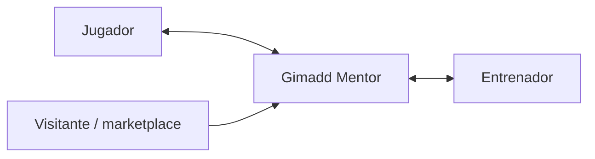

# Gimadd Mentor — Visión de producto para dirección

**Para:** Consejo / CEO / inversores  
**Fecha:** Mayo 2026  
**Enfoque:** qué construimos, para quién y qué valor aporta — **sin detalle de implementación técnica**.

---

## 1. En una frase

**Gimadd Mentor** es la plataforma que une a jugadores de **pádel** con sus entrenadores para entrenar con método: objetivos claros, seguimiento entre sesiones, vídeo con feedback profesional, reserva de pista y relación comercial ordenada — todo en **móvil** y, para el entrenador, también en **escritorio** cuando el trabajo es analizar vídeo o gestionar muchos clientes a la vez.

---

## 2. El ecosistema (quién entra en juego)

- **Jugador:** contrata, entrena, registra partidos y clases, sube vídeos, ve feedback, habla con su coach y sigue su plan.
- **Entrenador:** vende servicios, organiza agenda, da seguimiento, analiza vídeos, cobra con trazabilidad y gestiona su cartera de clientes como un negocio.
- **Visitante:** descubre entrenadores en un **marketplace** público y da el salto a la app con una invitación clara (código o enlace).

---

## 3. Dónde vive el producto (sin especificar tecnología)

| Canal | Para quién | Por qué importa al negocio |
|-------|------------|----------------------------|
| **App nativa Android** | Jugador y/o entrenador | Donde está el día a día: notificaciones, cámara, agenda en el bolsillo. |
| **App nativa iOS** | Igual | Paridad de experiencia en el mercado español y europeo de pádel. |
| **Aplicación de escritorio para el entrenador** | Entrenador profesional | Pantalla grande y flujo cómodo para **videoanálisis** y para **gestionar a muchos clientes** sin fricción. |
| **Web pública** | Captación | El **marketplace** da visibilidad y confianza antes de instalar la app. |

La misma persona puede usar móvil en pista y escritorio en casa; el valor es **continuidad**, no el dispositivo.

---

## 4. Marketplace público

**Qué es:** un escaparate de entrenadores verificados con su propuesta de valor, servicios y forma de contacto.

**Qué resuelve:** que un jugador nuevo **encuentre** a su entrenador sin depender solo del boca a boca, y que el entrenador **capture demanda** fuera de la app.

**Flujo humano:** buscar → ver perfil → obtener invitación (código o enlace) → entrar en la app y vincularse. En producción, la invitación debe ser **segura y controlada** (caducidad, anti-abuso), sin entrar en cómo se programa.

---

## 5. Alta de un entrenador

**Qué implica en negocio:**

1. **Registro** y verificación de identidad profesional (quién es, que puede cobrar y asesorar).
2. **Perfil comercial** listo para el marketplace: foto, zona, especialidad, mensaje de confianza.
3. **Catálogo de servicios** (precios, packs, mensualidades, programas largos) activable o pausable.
4. **Cuenta de cobros** alineada con normativa y facturación (el detalle operativo lo lleva el equipo financiero y legal; la app debe reflejar estados claros: cobrado, pendiente, factura disponible).

**Resultado para el CEO:** el entrenador puede empezar a **vender y operar** con una sola herramienta, con menos fricción que gestionar WhatsApp + Excel + Bizum sueltos.

---

## 6. Alta de un jugador

**Qué implica:**

1. Crear cuenta de jugador.
2. **Vincularse** a un entrenador mediante código, enlace de invitación o flujo del marketplace.
3. Ver su espacio personal: servicios contratados, objetivos, diario, vídeos y mensajes **solo** con ese entrenador (y con otros si en el futuro contrata más de uno).

**Resultado:** el jugador entiende **con quién entrena** y **qué ha comprado**; la plataforma evita mezclar conversaciones ni planes entre entrenadores.

---

## 7. Contratación de servicios — qué supone cada tipo (lenguaje de negocio)

| Tipo de servicio | Qué compra el jugador | Qué debe cumplir la experiencia |
|------------------|----------------------|--------------------------------|
| **Sesión suelta de videoanálisis** | Una revisión profesional de un vídeo suyo. | Plazos de entrega claros, cola visible para el jugador, notificación al coach. |
| **Sesión en pista (mentoría)** | Tiempo real con el entrenador. | Solicitud, confirmación de fecha, recordatorios, posibilidad de reprogramar con trazabilidad. |
| **Pack** | Varios usos (por ejemplo pista + vídeo) con una **caducidad** razonable. | Saldo de “sesiones restantes”, avisos antes de perder valor, transparencia en el consumo. |
| **Mensualidad** | Acceso recurrente (cupos que se renuevan cada mes). | Alta, cobro periódico, pausa o baja con reglas claras, sin sorpresas en la tarjeta. |
| **Programa de acompañamiento (3 / 6 / 12 meses)** | Un **camino** de mejora con ritmo y seguimiento. | Hitos de valor, combinación de pista, vídeo y objetivos, sensación de “proyecto”, no de ticket suelto. |

**Mensaje para dirección:** el catálogo no es solo “precios”: es la **política comercial** del entrenador empaquetada de forma que el jugador entienda qué recibe y qué debe hacer él (vídeo, asistencia, diario).

---

## 8. Objetivos y plan de acción

**Objetivo:** una mejora concreta (técnica, táctica o mental) con seguimiento en el tiempo.

**Plan de acción:** el conjunto de objetivos en los que el entrenador quiere que el jugador **se enfoque ahora**, ligados a la vida real: partidos y/o clases en pista.

**Regla de oro (producto):** el jugador registra prácticas en el **diario**; cuando el plan completo ha cumplido su ciclo de prácticas, el sistema pasa a una fase de **“pendiente de revisión”**: ahí el jugador sabe que debe **aportar un vídeo** para que el entrenador valore si ha mejorado. El **cierre** de objetivos lo confirma el entrenador tras ese feedback — refuerzo de valor percibido y control de calidad del servicio.

**Por qué importa al negocio:** aumenta **adherencia** (el jugador hace deberes entre clase y clase) y justifica **precio** (no es solo “una hora en pista”, es un proceso).

---

## 9. Diario de partidos y diario de clases

- **Diario de partidos:** qué jugó, cómo se sintió, resultados y notas. Sirve para memoria, para conversación con el coach y para alimentar el plan de acción.
- **Diario de clases en pista:** qué trabajó en mentoría presencial, sensaciones y vínculo con los objetivos del plan.

**Valor:** convierte la app en el **cuaderno digital** del deportista y da al entrenador contexto sin depender de mensajes sueltos.

---

## 10. Comentarios, revisión y “pendiente de análisis”

Cuando el plan pide revisión, el jugador ve **acciones claras** (subir vídeo, confirmar envío). El entrenador ve **urgencias** y puede priorizar quién está esperando feedback.

Si pasan demasiados días sin vídeo, el sistema **avisa al entrenador** para que contacte: reduce abandono y protege ingresos recurrentes.

---

## 11. Videoanálisis (qué ofrece el producto al usuario final)

**Lado jugador:** sube o graba vídeo, opcionalmente añade un comentario de contexto, y recibe un análisis **publicado**: mismo vídeo (o copia estable), marcas en el tiempo con explicaciones, nota global y, si aplica, material de apoyo (imagen, audio o clip corto).

**Lado entrenador:** reproductor cómodo, lista de marcas, redacción del feedback, posibilidad de **crear nuevos objetivos** a partir de lo visto, y publicación que deja constancia en el historial del jugador.

**Escritorio:** misma lógica con **vídeo grande** y flujo multitarea — diferencial para entrenadores de élite y academias con volumen.

---

## 12. Agenda y calendario

**Promesa de producto:** cuando una clase tiene fecha acordada, **aparece en la agenda** del jugador y del entrenador; lo ideal es que también se refleje en el **calendario personal** del entrenador (el que ya usa en su día a día), para reducir solapes y olvidos.

**Valor CEO:** menos cancelaciones “por despiste”, mejor uso de la pista, más sesiones facturadas y mejor reputación.

---

## 13. Finanzas y cobros

**Qué ve el entrenador:** resumen de lo cobrado, lo pendiente y la actividad reciente; acceso a **pagos** y **facturas** como espacio de confianza profesional.

**Qué ve el jugador (evolución natural):** recibos y estado de sus compras.

**Principio:** los cobros online deben ser **transparentes, reclamables y alineados con facturación** (IVA según país, datos fiscales del coach). La elección de pasarela y banco es decisión de implementación; a nivel negocio es “**pagos digitales serios**”, no Bizum informal suelto.

---

## 14. Alertas y acciones urgentes

**Tipos de situación que el producto debe destacar:**

- Plan listo para revisión y **falta vídeo** del jugador.
- Vídeo enviado y **coach pendiente** de publicar feedback (carga de trabajo visible).
- Clase sin fecha cerrada o **reprogramación** en curso.
- Recordatorio de **anotar en el diario** tras una sesión.
- (Futuro cercano) **pago fallido** o suscripción en riesgo.

**Valor:** la app **dirige la atención** hacia lo que genera ingreso o fidelización, no es solo un archivo estático.

---

## 15. Mensajería entre jugador y entrenador

**Qué es:** un hilo **por relación** jugador–entrenador, con historial y notificaciones.

**Por qué:** centraliza la coordinación (fechas, dudas, vídeos) y reduce dependencia de canales no controlados; además deja trazabilidad útil en reclamaciones o calidad del servicio.

---

## 16. CRM — gestión de clientes del entrenador

**Qué es:** la lista de **personas** (clientes activos, en pausa o leads sin servicio) con prioridad visual: quién necesita acción, quién es nuevo y quién lleva ritmo estable.

**Qué puede hacer el entrenador desde ahí:** buscar y filtrar, abrir ficha, ir a videoanálisis, enviar mensaje, ver servicios contratados y abrir el **seguimiento completo** del jugador cuando ya está en la app.

**Captación de clientes:** alta manual, enlace de invitación o código corto — tres caminos para el mismo objetivo: **meter al jugador en el sistema**.

**Mensaje CEO:** el CRM convierte la app en **herramienta de negocio**, no solo de contenido deportivo.

---

## 17. Seguimiento de un jugador (vista entrenador)

Una vez abierto un jugador, el entrenador navega por **perfil**, **videoanálisis**, **objetivos**, **diario** y **agenda de ese jugador**. Es el equivalente a “abrir el expediente” en una sola interfaz.

**Resultado:** menos tiempo administrativo, más tiempo de coaching; mejor NPS y más renovaciones.

---

## 18. Perfiles

**Entrenador:** quién es, qué ofrece, cómo contactar, cómo cobrar y cómo se ve en el marketplace.

**Jugador:** quién es, su contexto deportivo y cómo quiere ser entrenado; datos sensibles solo si aportan valor y con **consentimiento** claro.

---

## 19. Catálogo de servicios del entrenador

El entrenador **crea**, **edita**, **activa** o **desactiva** ofertas (sesión, pack, mensualidad, programa). Los textos son su **argumentario de venta** dentro de la app.

**Regla de negocio deseable:** desactivar un servicio **no debe romper** lo ya contratado; los clientes actuales siguen con las condiciones que aceptaron.

---

## 20. Servicios predefinidos (plantilla de partida)

Son **plantillas** que aceleran el arranque del entrenador; puede renombrarlas, ocultarlas o adaptarlas.

| Plantilla (resumen) | Propuesta de valor |
|---------------------|-------------------|
| Videoanálisis | Feedback asincrónico de calidad con plazo de entrega claro. |
| Mentoría en pista | Hora de trabajo técnico o táctico presencial. |
| Pack intensivo | Compromiso medio: combina pista y vídeo con caducidad. |
| Plan mensual | Relación continua: cupos que se renuevan cada mes. |
| Programas 3 / 6 / 12 meses | Acompañamiento profundo: proyecto, hábito y recurrencia de ingresos. |

---

## 21. Pantalla de inicio del jugador

**Qué debe mostrar y por qué:**

| Bloque | Información | Por qué |
|--------|--------------|--------|
| **Progreso / foco** | Objetivo principal del plan o estado “listo para revisión” | Da sentido inmediato a abrir la app cada semana. |
| **Acciones urgentes** | Vídeo pendiente, reprogramación, diario sin rellenar | Reduce abandono y incidencias. |
| **Próximas clases** | Fecha, estado y forma de pago entendible | Conecta lo digital con lo que pasará en el club. |

---

## 22. Pantalla de inicio del entrenador

| Bloque | Información | Por qué |
|--------|---------------|--------|
| **Agenda de hoy** | Quién entrena y a qué hora | Operativa del día. |
| **Urgencias** | Clientes que requieren acción, fechas abiertas, revisiones | Prioriza el tiempo del coach. |
| **Finanzas rápidas** | Cobrado / pendiente en ventana corta | Salud del negocio de un vistazo. |
| **Accesos** | Clientes, finanzas, promociones | Navegación rápida a “donde duele” el negocio. |

---

## 23. Qué puede hacer cada rol (sin matriz técnica)

**Jugador:** gestiona su experiencia (diario, vídeos, objetivos visibles, mensajes, contratación de lo ofertado, agenda propia). No gestiona el negocio de otros ni ve borradores internos del entrenador.

**Entrenador:** gestiona su cartera, su catálogo, su calendario operativo, sus análisis y sus cobros asociados a su actividad. No accede a jugadores con los que no tiene relación.

**Plataforma (futuro):** verificación, moderación y soporte para escalar con confianza de marca.

---

## 24. Confianza, privacidad y riesgos (visión ejecutiva)

- **Datos personales:** cumplir normativa europea (RGPD) como requisito de mercado, no como anexo.
- **Vídeos:** contenido sensible; control de acceso, retención acordada con el usuario y políticas claras de uso.
- **Pagos y facturas:** trazabilidad y disputas resolubles.
- **Abuso y fraude:** límites razonables en invitaciones, pagos y mensajes a medida que crezca la base.

**Mensaje:** sin este pilar, el crecimiento a **millones de usuarios** no es sostenible reputacional ni legalmente.

---

## 25. Escalabilidad y siguiente capítulo

**Hoy:** pádel, relación jugador–entrenador, operativa de academia o coach independiente.

**Mañana (sobre la misma base):** más deportes, automatizaciones, inteligencia asistida sobre vídeo, informes para clubes, integraciones federativas, B2B con escuelas.

**Implicación para dirección:** la primera versión debe ser **modular en producto** (servicios, roles, notificaciones, medios) aunque el lanzamiento sea acotado — evita reescrituras caras cuando el negocio demuestre tracción.

---

## 26. Cierre

Gimadd Mentor no es “una app más de pádel”: es el **sistema operativo** del entrenamiento personalizado entre sesiones — donde el jugador **siente progreso** y el entrenador **escala su negocio** con herramientas dignas de un servicio premium.

---

*Documento orientado a dirección. Para detalle funcional y técnico para proveedores de desarrollo, ver el brief complementario en la misma carpeta del proyecto.*
